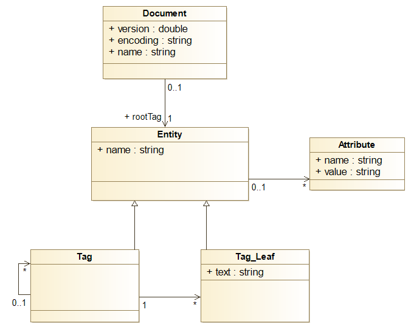

# XML Processing Library

# About
A Kotlin library for processing and manipulating XML documents.

This library was developed as the final project for [Advanced Programming](https://fenix-mais.iscte-iul.pt/courses/m4310-284502928661869/fuc)
course, under the guidance of *Professor André Santos*, in [Master's in Computer Engineering](https://www.iscte-iul.pt/curso/12/mestrado-engenharia-informatica/apresentacao) at 
[ISCTE - University Institute of Lisbon](https://www.iscte-iul.pt/).


# Features 
### **Part1 : Model**
- Add and remove entities
- Add, remove, and modify attributes in entities
- Access the parent entity and child entities of an entity
- Pretty print in string format and write to file
- Traverse the document with visitor objects (Visitor)
- Add attributes globally to the document (providing entity name, attribute name, and value)
- Rename entities globally in the document (providing old and new names)
- Rename attributes globally in the document (providing entity name, old and new attribute names)
- Remove entities globally from the document (providing name)
- Remove attributes globally from the document (providing entity name and attribute name)
- MicroXPath
  - Obtain XML fragments, by allowing querying the document with simple XPath expressions
- Validation

### **Part2 : Mapping XML Classes**
- Change names of identifiers in the translation to XML
- Determine how attributes and objects are translated (XML attribute or entity)
- Exclude attributes from objects
- Change toString function depending on a specified class
- Change order of the XML depending on a specified class
- Validations

### **Part3 : DSL**
- DSL


# Instructions Part1

With this library you are allowed to create and manipulate different entities.
We have :
 - Data Classes: Document, Tag, Tag_Leaf and Attributes
 - Interface: Entity
 
<br>
All classes and interfaces are connected by the following way:




<br>
A Document must always have a root (Tag), a version, an encoding and its name.
And from the root on the document is created with nesting Entities.

### Example

Creation of a Document:
```kotlin
    val rootTag = Tag("root")

    //By default, version= 1.0 and encoding"UTF-8"
    val document = Document(rootTag, name = "Document")
```

An Entity is an Interface, and each Entity may be a Tag or a Tag_Leaf depending on their characteristics.
<br>A Tag is an entity that may or not have a parent but has children nested to it and does not have any text in it.
<br>A Tag_Leaf on the other side must always have a parent Tag and does not have children nested, it may or not have text in it.

### Example 
Creation of a Tag and a Tag_Leaf:
  ```kotlin
    val tag = Tag("name")
    
    val tag_leaf = Tag_Leaf("name",parent = tag,"text")
  ```


All the entities may have associated to them one or more attributes.
An Attribute may be created as a singular Attribute and later be added to an Entity, or it may be created associated to an Entity.

### Example

Creation of Attributes:
```kotlin
    val attribute = Attribute("name","value")

    val attribute_associatedWithEntity = Attribute("name","value",parentEntity)
```

Now that the "skeleton" its created we may do various actions with them.
From adding Entities and Attributes, removing them or changing their values/names and more.
<br>Below are a few functions available.

| Function                                                                     | Description                                                                                                                 |
|------------------------------------------------------------------------------|-----------------------------------------------------------------------------------------------------------------------------|
| ` tag.addEntity(Entity) `                                                    | Adds an Entity to a Tag                                                                                                     |
| ` entity.remove() `                                                          | Removes the Entity and all its nested children (if it has)                                                                  |
| `entity.changeName(String)`                                                  | Changes the name of an Entity                                                                                               
| ` entity.add(Attribute)`                                                     | Adds an Attribute to an Entity                                                                                              |
| `entity.removeAttribute(Attribute)`                                          | Removes an Attribute of an Entity                                                                                           |
| `attribute.changeValueTo(String)`                                            | Changes the value of an Attribute                                                                                           |
| `attribute.changeNameTo(String)`                                             | Changes the name of an Attribute                                                                                            |
| `document.addAttributeGlobally(Entity Name ,Attribute Name,Attribute Value)` | Adds an Attribute to all Entities with the "Entity Name" in the document (providing entity name, attribute name, and value) |
| ` document.changeTagNameGlobally(Entity OldName,Entity NewName)`             | Renames all entities globally in the document (providing old and new names)                                                 |
| `document.removeEntityGlobally(Entity Name)`                                 | Removes all entities with the "Entity Name" in the Document                                                                 |
| `document.prettyPrint()`                                                     | Pretty prints in xml format the Document                                                                                    |
| `document.microXpath(path)`                                                  | Returns the fragments of the XML, by providing the path                                                                     


# Instructions Part2

In this part it was to obtain XML entities automatically from objects based on the structure of the respective classes, offering some flexibility for customization through annotations in the classes.
<br> 
The annotations created for this effect were:

| Annotation                                                       | Description                                                                                                       |
|----------------------------------------------------------------|-------------------------------------------------------------------------------------------------------------------|
| ` annotation class Name(val str: String) `                     | This annotation is used to  to define the preffered name of Classes/Properties                                    |
| ` annotation class Attributes() `                              | This annotation identifies a property as an Attribute                                                             |
| `annotation class Tags()` | This annotation identifies a class/property as a Tag                                                              |
| `annotation class TagLeafs()` | This annotation identifies a property as a Tag_Leaf                                                               |
| `annotation class Exclude()` | This annotation identifies a property that must be excluded                                                       |
| `annotation class XmlString(val str: KClass<out StringChange>)` | This annotation is applied to classes to change the toString function depending on the class given                |
| `annotation class XmlAdapter(val xmlAdapter:KClass<out AdapterXML>)` | This annotation is applied to classes to change the order of the objects (for example) depending on the class given |

The annotations are optional, in case there are no annotations in the class, the code will by default create correctly Tags and Tag_leafs. 
<br>However in case you want to create an Attribute, by default it will be created a Tag_Leaf, so in this situation you must specify it as an Attribute using an annotation.
### Example of a class with annotations
```kotlin
      @Name("fuc")
      @XmlAdapter(FUCAdapter::class)
      data class FUC(
      @Attributes
      val codigo: String,
      @TagLeafs
      val nome: String,
      @TagLeafs
      val ects: Double,
      @TagLeafs
      @Exclude
      val observacoes: String,
      @Tags
      val avaliacao: List<ComponenteAvaliacao>
)
```

### Example of an XML creation from an Object

#### Code
```kotlin
  fun main() {
      val fuc = FUC("M4310", "Advanced Programming", 6.0, "la la...",
          listOf(
              ComponenteAvaliacao("Quizzes", 20),
              ComponenteAvaliacao("Project", 80),
              ComponenteAvaliacao("Test", 10)
          )
      )
  
      print(createXML(fuc,null).prettyPrint(0))
  }
```

#### Output
   
    <fuc codigo='M4310'>
      <nome> Advanced Programming </nome>
      <ects> 6.0 </ects>
      <avaliacao>
        <componente nome='Quizzes',  peso='20%'>
        <componente nome='Project',  peso='80%'>
        <componente nome='Test',  peso='10%'>
      </avaliacao>
    </fuc>


# DSL

Creation of a Document (there is not a DSL for this) and creation of Tags, Tag_Leafs and Attributes by using the DSL 
```kotlin
  val plano : Tag = tag("plano"){    
      attribute("unidade curricular","PA")

      tagLeaf("curso","Mestrado em Engenharia Informatica")

      tag("fuc"){
          attribute("codigo", "M0000")
          tagLeaf("ects","6.0")
          tag("avaliacao"){
              tagLeaf("componente"){
                  attribute("nome", "teste")
                  attribute("peso","40%")
              }
          }
      }
  }
  
  val document = Document(plano,"documento")
```
Accessing an Entity or an Attribute using the DSL:
```kotlin
// Access the first "fuc" Tag, by default, within the children of "plano"
  plano["fuc"] 

// Access the second "fuc" Tag within the children of "plano" by specifying its index
  plano["fuc",0]

// Access the first "componente" Tag_Leaf within the "avaliacao" Tag inside the first "fuc" Tag
  plano["fuc"]["avaliacao"]["componente"] 

// Access all Attributes of the "plano" Entity
  plano.listAttribute

// Access a specific Attribute (the first one) of the "plano" Entity
  plano.listAttribute[0]

```


# Credits

Credit for all the code present in this repository goes to [Catarina Moreira](https://www.linkedin.com/in/catarina-moreira-76453b205/) and [João Pereira](https://www.linkedin.com/in/jo%C3%A3o-vilares-pereira-180223227/).
